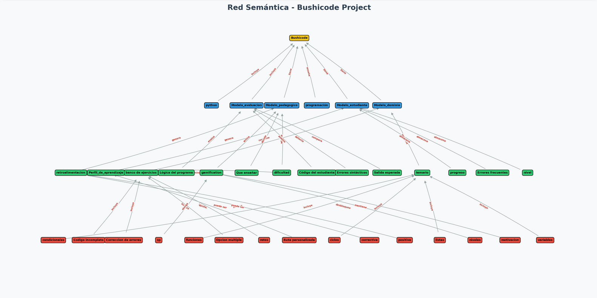

# BushiCode
Bienvenido al repositorio de **BushiCode**. 
Sigue estos pasos para ejecutar el proyecto en tu computadora local.

## Tecnologías Utilizadas
- **Backend:** Python, Flask
- **Base de Datos:** MySQL
- **Frontend:** HTML5, CSS3, JavaScript (Vanilla)

## Documentación del Proyecto
Toda la lógica y las reglas de nuestro sistema experto se encuentran documentadas en:
**[Ver documentación](docs/SISTEMA_EXPERTO.md)**

## Red Semantica
El proyecto incluye un script en Python que genera una red semántica dinámicamente. El archivo `main.py` lo manda a llamar. Puedes visualizarla al iniciar el programa y dar clic en el botón **Red Semántica**.
****

## Instalación y Configuración

### Dependencias
???

### Configuración de la Base de Datos
1. Abre tu gestor (phpMyAdmin, Workbench, etc.).
2. Abre el archivo `database/esquema.sql`.
3. Copia el código y ejecútalo en tu consola SQL.

### Correr el Servidor
Una vez que la base de datos esté creada y las dependencias instaladas, ejecuta el archivo principal:
    **python main.py**
Si la terminal no muestra la dirección, abre tu navegador en *http://localhost:5000*.

*Nota: Asegúrate de tener instalado Python y las dependencias necesarias antes de ejecutar el proyecto.*